# Laporan Proyek Machine Learning - Aliffa Agnur

## Domain Proyek

Hujan merupakan salah satu fenomena alam yang menunjukan jatuhnya titik air dari atmosfer ke permukaan bumi. Curah hujan adalah jumlah air yang jatuh di tanah datar selama periode tertentu yang diukur dengan satuan tinggi (mm) di atas permukaan horizontal. Jumlah curah hujan diukur sebagai volume air yang jatuh di atas permukaan bidang datar dalam periode waktu tertentu, yaitu harian, mingguan, bulanan, atau tahunan. Intensitas curah hujan yang tinggi yang sering disebut hujan ekstrem dapat mengakibatkan terjadinya bencana alam (Laia & Setyawan, 2020). [[1]](https://eprints.unpak.ac.id/7983/1/Skripsi_065119023_Feri%20Irawan.pdf) <br>
Curah hujan yang tidak menentu dapat menyebabkan banjir, kekeringan, dan kerugian ekonomi. Oleh karena itu, prediksi curah hujan yang akurat sangat penting untuk perencanaan dan pengambilan keputusan yang efektif. [[2]](https://ejurnal.itenas.ac.id/index.php/mindjournal/article/view/9220) <br>
Curah hujan dapat diprediksi dengan menerapkanMachine Learning yang merupakan cabang ilmu turunan dari Artificial Intelligenceatau kecerdasan buatan. Machine Learning membahas bagaimana algoritma komputer dapat mempelajari data yang diinputkan dengan mengenali sifat karakter data atau pola data, kemudian akan mengubah pola data yang berhasil dipelajari menjadi sebuah tindakan yang meminimalisir pekerjaan yang membutuhkan manusia. [[3]](https://repository.unsri.ac.id/83938/3/RAMA_45201_08021381823054_0015096101_0009067603_01_front_ref.pdf) <br>

**Mengapa Masalah ini harus diselesaikan?**:
1.  Prediksi curah hujan yang akurat sangat penting dalam sektor pertanian, karena membantu petani merencanakan waktu tanam dan panen dengan lebih efisien, sehingga dapat meningkatkan hasil pertanian dan mengurangi risiko gagal panen. [Pentingnya Memahami Cuaca dan Pengaruhnya ke Pertanian](https://ugm.ac.id/id/berita/pentingnya-memahami-cuaca-dan-pengaruhnya-ke-pertanian/) <br>
2. Dalam perencanaan kota, data curah hujan yang akurat memungkinkan pemerintah dan perencana kota mengelola infrastruktur perkotaan, seperti sistem drainase, untuk mencegah banjir dan kerusakan lainnya. [Pentingnya Sensor Curah Hujan pada Weather Station](https://loggerindo.com/2024/11/14/pentingnya-sensor-curah-hujan-pada-weather-station/) <br>
3. Curah hujan memiliki peran terpenting dalam menentukan ketersediaan air di berbagai wilayah. Ketika air hujan turun, maka sebagian air akan mengalir di permukaan tanah sebagai limpasan, mengisi waduk, danau, sungai, sedangkan sebagian lainnya meresap ke dalam tanah untuk memperbarui akuifer. Tersedianya curah hujan yang cukup sangat penting untuk menjamin ketersediaan air bagi berbagai kebutuhan manusia, dimulai dari kebutuhan rumah tangga, operasional industri, hingga irigasi pertanian. [Pemantauan Curah Hujan untuk Manajemen Sumber Daya Air yang Berkelanjutan](https://www.mertani.co.id/post/pemantauan-curah-hujan-untuk-manajemen-sumber-daya-air-yang-berkelanjutan)


**Bagaimana Masalah ini diselesaikan?** :
1. <a href="https://scholar.google.com/citations?view_op=view_citation&hl=id&user=8mExcgIAAAAJ&citation_for_view=8mExcgIAAAAJ:KlAtU1dfN6UC" style="text-decoration: none;">Prediksi Curah Hujan Harian di Stasiun Meteorologi Kemayoran Menggunakan Artificial Neural Network (ANN)</a>

   - Penelitian ini memanfaatkan jaringan saraf tiruan untuk memprediksi curah hujan harian di Stasiun Meteorologi Kemayoran. Data cuaca harian dari Januari 2011 hingga Desember 2019 digunakan untuk pelatihan model, yang kemudian diuji dengan data dari Januari hingga Agustus 2020. Variasi model dibuat berdasarkan jenis input dan jumlah lapisan tersembunyi. Hasil penelitian menunjukkan bahwa penggunaan parameter input kondisi cuaca permukaan seperti suhu udara, kelembaban udara, dan durasi penyinaran matahari memberikan nilai koefisien korelasi sebesar 0,4–0,5 dan MAE 9,7–9,8 mm. Sebaliknya, penggunaan data hujan hari-hari sebelumnya sebagai input menghasilkan korelasi 0,1–0,3 dan MAE 11,3–12,3 mm, menunjukkan bahwa parameter cuaca permukaan lebih efektif sebagai prediktor.

2. [Prediksi Curah Hujan di Wilayah DKI Jakarta dengan Model NeuralProphet](https://scholar.google.com/citations?view_op=view_citation&hl=id&user=8Z4345gAAAAJ&citation_for_view=8Z4345gAAAAJ:2P1L_qKh6hAC)
   - Penelitian ini menggunakan model NeuralProphet untuk memprediksi curah hujan bulanan dan harian di DKI Jakarta. Data yang digunakan adalah data satelit PERSIAN-CCS dari Januari 2005 hingga Juni 2021. Hasil penelitian menunjukkan bahwa secara spasial, model NeuralProphet dapat mengklasifikasikan persebaran curah hujan di wilayah DKI Jakarta. Namun, terdapat perbedaan nilai yang cukup tinggi antara prediksi dan data observasi. Prediksi bulanan menghasilkan akurasi terbaik dengan korelasi 0,8, RMSE 58,45 mm, dan MAE 23,37 mm, sedangkan prediksi harian memiliki korelasi 0,55, RMSE 10,73 mm, dan MAE 9,32 mm.

3. <a href="https://journal.universitasmulia.ac.id/index.php/seminastika/article/view/237" style="text-decoration: none;">PREDIKSI TINGGI CURAH HUJAN DAN KECEPATAN ANGIN BERDASARKAN DATA CUACA DENGAN PENERAPAN ALGORITMA ARTIFICIAL NEURAL NETWORK (ANN)</a>
   - Berdasarkan hasil yang telah diperoleh selama   proses   pengerjaan   yaitu   melakukan prediksi  terhadap  curah  hujan  dan  kecepatan angin     maka     dapat     disimpulkan     bahwa pemodelan  terbaik  dalam  melakukan  prediksi curah hujan adalah dengan algoritma Backprpagation  Neural  Network yaitu  dengan dengan  nilai  RMSE  0.079535  yaitu  dengan  20 neuron,  1000 epoch, serta validation  split 0.1. Untuk   pemodelan   terbaik   dalam   melakukan prediksi    kecepatan    angin    adalah    dengan menggunakan    algoritma Reccurent    Neural Network dengan  menggunakan  arsitektur Long Short Term Memory (LSTM) yaitu dengan nilai RMSE   yang   diperoleh   berada   pada   nilai 0.06281251 dengan 30 neuron, 800 epoch, serta validation split 0.1. 


## Business Understanding

Pada bagian ini, kamu perlu menjelaskan proses klarifikasi masalah.

Bagian laporan ini mencakup:

### Problem Statements

1. Bagaimana cara membangun model yang dapat mengklasifikasikan kejadian hujan yg bisa memprediksi ramalan cuaca di kota besar berdasarkan fitur-fitur yg ada di dataset tsb?
2. Fitur mana saja yang memiliki korelasi signifikan dan berpengaruh dalam prediksi klasifikasi hujan? Sejauh mana masing-masing fitur mempengaruhi hasil prediksi?
3. Bagaimana mengatasi ketidakseimbangan kelas pada data target agar model dapat belajar dengan baik dari setiap kelas dan meningkatkan akurasi prediksi, terutama pada kelas minoritas?

### Goals

1. Membangun model prediksi yang mampu mengklasifikasikan kejadian hujan dengan akurasi tinggi menggunakan metrik evaluasi ROC-AUC. Metrik ROC-AUC sangat berguna dalam mengukur performa model klasifikasi, khususnya dalam situasi imbalanced data, karena metrik ini mempertimbangkan trade-off antara True Positive Rate dan False Positive Rate.
2. Melakukan analisis mendalam terhadap korelasi antar fitur untuk mengidentifikasi fitur-fitur utama yang berpengaruh dalam prediksi hujan. Hal ini juga mendukung upaya feature engineering untuk menghasilkan pola baru yang lebih representatif dari data asli.
3. Menerapkan teknik oversampling, seperti SMOTE, borderline SMOTE, ADASYN, dan SVM SMOTE, guna menangani permasalahan ketidakseimbangan kelas. Dengan demikian, model dapat memperoleh pembelajaran yang lebih seimbang dan meningkatkan performa evaluasi menggunakan ROC-AUC.

    ### Solution statements
   1. **Membangun Ensemble Model dengan Algoritma Boosting dan Menggabungkan nya menggunakan Fusion Model**
      - Menerapkan beberapa algoritma boosting seperti GBM, LGBM, AdaBoost, XGBoost, dan CatBoost.
      - Mengoptimasi hyperparameter masing-masing model menggunakan Optuna.
      - Menggabungkan model-model tersebut melalui teknik Stacking untuk meningkatkan kekuatan prediksi dan mengurangi risiko overfitting.
   2. **Menggunakan Keras-Tuner untuk membangun Model Prediksi**
      - Membangun model deep learning Menggunakan FeedForward Neural Network Architecture.
      - Menggunakan Keras-Tuner untuk menemukan kombinasi hyperparameter terbaik sehingga model dapat belajar dengan optimal dari data.
   3. **Feature Engineering**
      - Menerapkan teknik feature engineering untuk menciptakan fitur baru yang dapat menangkap pola tersembunyi dari data asli.
      - Analisis korelasi akan membantu dalam pemilihan fitur yang relevan sehingga model menjadi lebih efisien dan akurat.
   4. **Penanganan Imbalanced Data**
      - Mengimplementasikan berbagai teknik oversampling (SMOTE, borderline SMOTE, ADASYN, SVM SMOTE) untuk menyeimbangkan distribusi kelas dalam data target.
      - Teknik ini diharapkan dapat meningkatkan kemampuan model dalam mempelajari karakteristik masing-masing kelas, terutama kelas yang kurang terwakili.

## Data Understanding
Dataset ini merupakan kumpulan data meteorologi yang disusun untuk tujuan prediksi curah hujan melalui pendekatan klasifikasi. Data diambil dalam satuan waktu tertentu (misalnya harian) dan memuat berbagai fitur yang berkaitan dengan kondisi cuaca. Tujuan dataset ini untuk memprediksi hujan berdasarkan fitur-fitur yg tersedia. 
Dataset ini bisa diakses di : [Binary Prediction with a Rainfall Dataset](https://www.kaggle.com/competitions/playground-series-s5e3/overview/timeline)

### Variabel-variabel pada Rainfall Prediction Dataset adalah sebagai berikut:

| **Nama Fitur**     | **Penjelasan**                                                                                       |
|--------------------|------------------------------------------------------------------------------------------------------|
| `id`               | Identifier unik untuk setiap entri data.                                                             |
| `day`              | Mewakili hari pengamatan. day 1 - 365                                                                |
| `pressure`         | Nilai tekanan udara yang berpengaruh pada kondisi atmosfer. (hPa).                                   |
| `maxtemp`          | Suhu maksimum (°C) pada hari tersebut.                                                               |
| `temparature`      | Suhu rata-rata (°C) sepanjang hari.                                                                  |
| `mintemp`          | Suhu minimum (°C) pada hari tersebut.                                                                |
| `dewpoint`         | Titik embun (°C).                                                                                    |
| `humidity`         | Kelembapan relatif (%).                                                                              |
| `cloud`            | Persentase tutupan awan (%). Tutupan awan yang tinggi sering dikaitkan dengan potensi hujan.         |
| `sunshine`         | Jumlah sinar matahari (jam). Semakin sedikit sinar matahari, peluang hujan biasanya meningkat.       |
| `winddirection`    | Arah angin (derajat). Memengaruhi pola cuaca dengan membawa kelembapan dari wilayah tertentu.        |
| `windspeed`        | Kecepatan angin (km/jam). Indikasi keberadaan sistem cuaca yang kuat yang bisa menghasilkan hujan.   |
| `rainfall`         | Prediksi Hujan (0 = Tidak Hujan, 1 = Hujan)                                                          |


## Exploratory Data Analysis (EDA)
Analisis ini menggunakan 2 File CSV yg berbeda , yaitu :
  1. **train.csv** : digunakan untuk membuat model prediksi dan mengevaluasinya. terdiri dari 2190 baris dan 13 kolom.
  2. **test.csv**  : digunakan untuk memprediksi model berdasarkan data baru yg belum pernah ada sebelumnya. terdiri dari 730 baris dan 13 kolom.

### Isi Dataset 
| id | day | pressure | maxtemp | temparature | mintemp | dewpoint | humidity | cloud | sunshine | winddirection | windspeed | rainfall |
|----|-----|----------|---------|-------------|---------|----------|----------|-------|----------|---------------|-----------|----------|
| 0  | 1   | 1017.4   | 21.2    | 20.6        | 19.9    | 19.4     | 87.0     | 88.0  | 1.1      | 60.0          | 17.2      | 1        |
| 1  | 2   | 1019.5   | 16.2    | 16.9        | 15.8    | 15.4     | 95.0     | 91.0  | 0.0      | 50.0          | 21.9      | 1        |
| 2  | 3   | 1024.1   | 19.4    | 16.1        | 14.6    | 9.3      | 75.0     | 47.0  | 8.3      | 70.0          | 18.1      | 1        |
| 3  | 4   | 1013.4   | 18.1    | 17.8        | 16.9    | 16.8     | 95.0     | 95.0  | 0.0      | 60.0          | 35.6      | 1        |
| 4  | 5   | 1021.8   | 21.3    | 18.4        | 15.2    | 9.6      | 52.0     | 45.0  | 3.6      | 40.0          | 24.8      | 0        |

### Deskripsi Dataset 
```python
<class 'pandas.core.frame.DataFrame'>
RangeIndex: 2190 entries, 0 to 2189
Data columns (total 13 columns):
 #   Column         Non-Null Count  Dtype  
---  ------         --------------  -----  
 0   id             2190 non-null   int64  
 1   day            2190 non-null   int64  
 2   pressure       2190 non-null   float64
 3   maxtemp        2190 non-null   float64
 4   temparature    2190 non-null   float64
 5   mintemp        2190 non-null   float64
 6   dewpoint       2190 non-null   float64
 7   humidity       2190 non-null   float64
 8   cloud          2190 non-null   float64
 9   sunshine       2190 non-null   float64
 10  winddirection  2190 non-null   float64
 11  windspeed      2190 non-null   float64
 12  rainfall       2190 non-null   int64  
dtypes: float64(10), int64(3)
memory usage: 222.5 KB
```

### ❓ Check Missing Values 🛑
  - **Train Data** :
```python
id               0
day              0
pressure         0
maxtemp          0
temparature      0
mintemp          0
dewpoint         0
humidity         0
cloud            0
sunshine         0
winddirection    0
windspeed        0
rainfall         0
dtype: int64
```

  - **Test Data** :
```
id               0
day              0
pressure         0
maxtemp          0
temparature      0
mintemp          0
dewpoint         0
humidity         0
cloud            0
sunshine         0
winddirection    1
windspeed        0
dtype: int64
```
Terdapat 1 nilai yg hilang untuk fitur *winddirection* dari dataset test.csv 

### 📊 Check Data Distribution 🌐
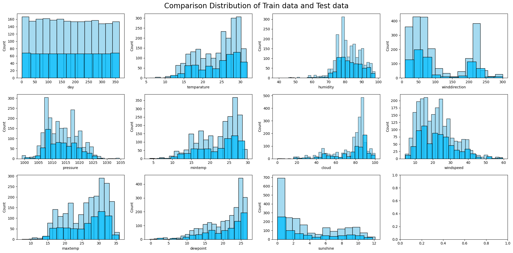

dari distribusi data tsb, saya membandingkan distribusi antara train and test data. lalu dapat disimpulkan bahwa distribusi data antara data train and test itu terlihat sama satu sama lain. ok sekarang mari kita tampilkan perbandingan distribusi antara prediksi hujan dan tidak hujan dalam Train data.

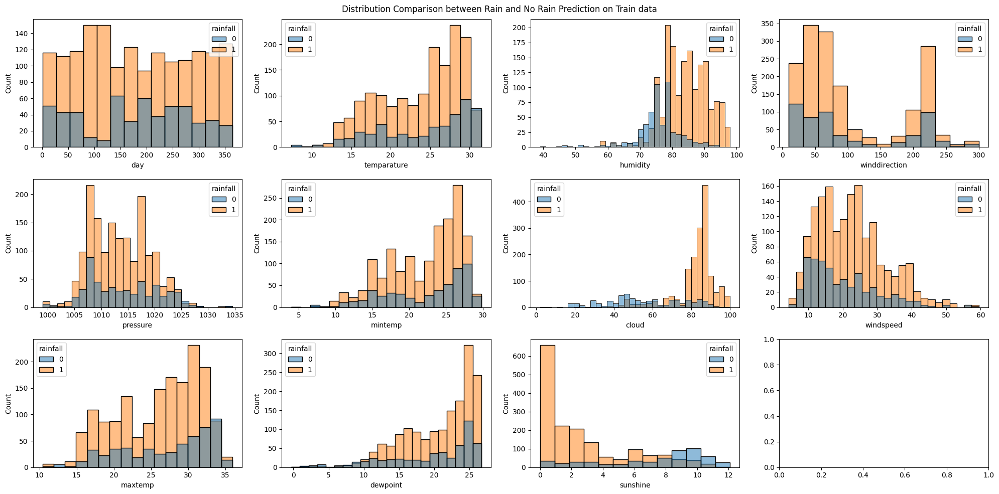

Note :
   - Batang berwarna **Kuning** merupakan distribusi untuk Prediksi Hujan
   - Batang berwarna **Biru muda** merupakan distribusi untuk prediksi tidak hujan
   - Batang berwarna **abu-abu** merupakan distribusi gabungan antara distribusi hujan dan tidak hujan

🧮 Penjelasan :
   - 1️⃣ Distribusi hujan dan tidak hujan terlihat hampir merata dan serupa di sepanjang hari. Tidak ada pola signifikan yang memperlihatkan peningkatan probabilitas hujan pada hari-hari tertentu. Fitur **days** tampaknya kurang berpengaruh dalam memprediksi hujan atau tidak hujan, karena distribusinya relatif mirip untuk kedua kategori.<br>
   - 2️⃣ Saat suhu (**temparature, mintempt, maxtemp**) makin tinggi, proporsi data yang hujan cenderung meningkat. Ini terlihat dari “puncak” histogram untuk hujan yang lebih banyak pada rentang suhu menengah-tinggi.
   - 3️⃣ Terlihat perbedaan mencolok; pada kelembapan (**humidity**) tinggi (80% ke atas), porsi hujan mendominasi. Pada kelembapan rendah, lebih didominasi tidak hujan.
   - 4️⃣ Distribusi arah angin (**winddirection**) tampak lebih tersebar dan tidak sejelas fitur lain. Mungkin ada sedikit pola di arah angin tertentu yang lebih sering hujan, namun tidak sedrastis kelembapan atau suhu. Arah angin bisa memiliki pengaruh, tapi tidak sekuat kelembapan atau suhu. 
   - 5️⃣ Saat tekanan (**pressure**) udara rendah, proporsi hujan terlihat lebih tinggi; sebaliknya, pada tekanan udara tinggi, lebih banyak data tidak hujan.
   - 6️⃣ Pada tingkat awan (**cloud**) tinggi (mendekati 100%), mayoritas data menunjukkan hujan. Ketika awan rendah (langit lebih cerah), lebih banyak data tidak hujan. Fitur cloud sangat signifikan membedakan hujan dan tidak hujan. semakin banyak awan, semakin besar peluang hujan.
   - 7️⃣ Ada kecenderungan bahwa hujan muncul pada rentang kecepatan angin (**windspeed**) yang agak lebih tinggi, tapi tidak sedramatis fitur kelembapan/awan. Kecepatan angin memiliki pengaruh sedang. Angin yang lebih kencang kadang menandakan sistem tekanan rendah yang membawa hujan, namun korelasinya tidak selalu kuat.
   - 8️⃣ Pada titik embun tinggi, hujan cenderung lebih banyak; ini karena titik embun tinggi menandakan kelembapan yang tinggi di udara.
   - 9️⃣ Ketika durasi sinar matahari (**sunshine**) panjang, mayoritas data adalah tidak hujan. Sebaliknya, pada durasi sinar matahari yang singkat, proporsi hujan meningkat.

<br>

selanjutnya kita akan cek perbandingan distribusi antara Prediksi Hujan dan Tidak Hujan <br>

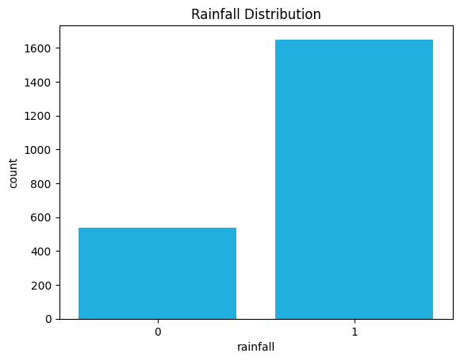


pada distribusi ini , terjadi ketidakseimbangan data (Imbalance Data) antara prediksi hujan dan tidak hujan. 
```python
Class Percentages : rainfall
1    75.34
0    24.66
Name: proportion, dtype: float64
```
untuk menangani ini, saya akan mencoba melakukan teknik *Oversampling* untuk menangani Imbalance Data ini.

------------------------------------------------------------------------------------------------------

dari distribusi data tsb, mari kita cek seberapa normal distribusi data tsb menggunakan *QQ-Plot*

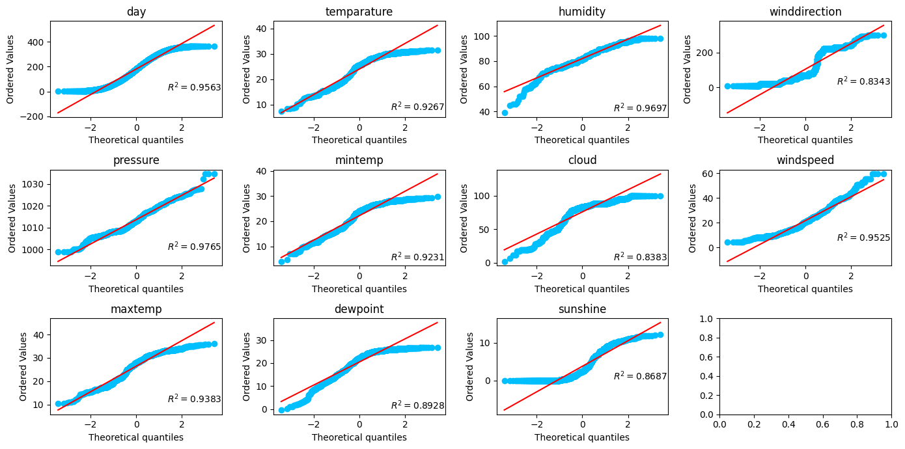

Titik-titik data yang lurus sepanjang garis merupakan distribusi normal. Sementara titik-titik data yang membelok ke kiri/kanan merupakan distribusi yang miring. Nilai R2 menunjukkan seberapa dekat kumpulan data tersebut mendekati distribusi normal. Semakin tinggi nilai R2, semakin dekat dengan distribusi normal.
dari QQ-plot tsb. **pressure, humidity, windspeed** merupakan 3 fitur yg paling mendekati distribusi normal. <br>
*Tujuan memvisualisasi QQ-plot ialah untuk melihat bentuk dari distribusi data tsb, karena dataset yg mempunyai distribusi normal sangat baik untuk menggunakan model klasifikasi Linear , seperti : **Logistic Regression, Linear Discriminant Analysis (LDA), Support Vector Machine Linear, Perceptron Neural Network, Online Classifier, Passive Aggressive Classifier, Maximum Entropy Classifier**.*

### 🔗 Check Correlation 🔍

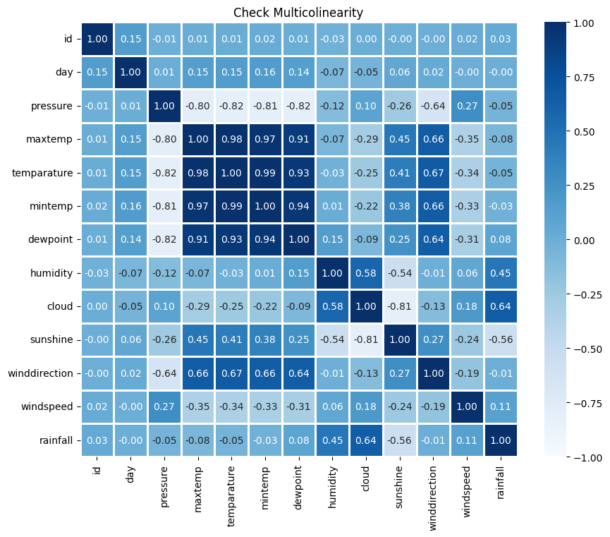

1. **Korelasi sangat tinggi (Multikolinearitas sangat tinggi)**
   1. **maxtemp ↔ temperature (0.94)** <br>
      Nilai korelasinya sangat tinggi (mendekati 1). Artinya, saat **maxtemp** naik, **temperature** juga naik (dan sebaliknya). Keduanya bisa dianggap mengukur aspek suhu yang hampir sama dalam data ini.
   2. **temperature ↔ mintemp (0.88)** <br>
      Sama-sama berhubungan kuat. Menunjukkan bahwa ketika **temperature** umum meningkat, **mintemp** juga cenderung meningkat.
   3. **humidity ↔ dewpoint (0.89)** <br>
      Keduanya memiliki hubungan yang sangat erat. Bila **dewpoint** meningkat, **humidity** juga meningkat. Ini menunjukkan keduanya memuat informasi kelembapan yang serupa.

2. **Korelasi Tinggi (Multikolinearitas tinggi)**
   1. **cloud ↔ sunshine (-0.70)** <br>
      Korelasi negatif kuat. Semakin besar nilai **cloud**, semakin rendah **sunshine**, dan sebaliknya. Artinya, kedua variabel ini saling “menggantikan” satu sama lain di dalam data.
   2. **pressure ↔ sunshine (0.59) dan pressure ↔ cloud (-0.51)** <br>
      **pressure** memiliki korelasi positif cukup kuat dengan **sunshine (0.59)** dan negatif dengan **cloud (-0.51)**. Artinya, dalam data ini, saat **pressure** meningkat, **sunshine** cenderung naik, sedangkan **cloud** cenderung turun.
   3. **maxtemp ↔ sunshine (0.66), temperature ↔ sunshine (0.70), dan mintemp ↔ sunshine (0.53)** <br>
      Secara umum, kelompok **temperature** (baik **maxtemp**, **temperature**, maupun **mintemp**) menunjukkan korelasi positif moderat dengan **sunshine**, dan negatif dengan **cloud**. Hal ini menggambarkan bahwa saat suhu meningkat, **sunshine** cenderung meningkat, sedangkan **cloud** cenderung menurun.

3. **Korelasi Rendah (Tak ada Multikolinearitas)**
   1. **winddirection** <br>
      Secara umum memiliki korelasi yang sangat rendah dengan variabel lain (misal: ~0.01 dengan **windspeed**, ~-0.01 s/d ~0.13 dengan variabel lain). Ini menunjukkan **winddirection** dalam dataset ini relatif berdiri sendiri, tidak bergerak seiring variabel lain.
   2. **windspeed**  <br>
      Hampir tidak berkorelasi kuat dengan variabel lain (mayoritas di bawah 0.10). Jadi **windspeed** juga tidak terlalu “terikat” dengan variabel lain dalam dataset ini.
   3. **day**   <br>
      Korelasinya juga lemah dengan variabel lain (kebanyakan di bawah ±0.15). Ini menunjukkan **day** (mungkin penomoran hari) tidak berasosiasi kuat dengan perubahan variabel cuaca lainnya pada dataset ini.


🧮 untuk fitur Independent yg multikolinearitas, kita bisa lakukan hal-hal ini :
   - 1️⃣ Hapus Variable2 yg saling berkorelasi
   - 2️⃣ Gunakan _Principal Component Analysis (PCA)_ untuk mengatasi multikolinearitas
   - 3️⃣ Menggabungkan variabel2 yang multikolinearitas kemudian menghapus variabel asli
   - 4️⃣ Transformasi data dari variable yg multikolinearitas (seperti transformasi log, transformasi akar kuadrat atau lainnya)
   - 5️⃣ Menambahkan regularisasi Ridge (L2) atau regularisasi Lasso (L1) untuk menambahkan penalti dan mengurangi multikolinearitas
   - 6️⃣ Pertimbangkan teknik pemilihan fitur seperti Recursive Feature Elimination (RFE)
   - 7️⃣ Bereksperimen dengan Feature Engineering untuk menggabungkan fitur-fitur yang berkorelasi
   - 8️⃣ Gunakan model ensemble yang dapat menangani fitur berkorelasi secara lebih efektif
   - 9️⃣ Cobalah model berbasis pohon yang kurang sensitif terhadap multikolinearitas
   - 🔟 Uji ambang korelasi yang berbeda untuk memutuskan fitur mana yang akan dihapus

*Tujuan membuat heatmap dari **Korelasi Pearson** ini adalah untuk melihat interaksi antar variable dan juga untuk menghindari dan menangani variable2 independen yg saling berkorelasi kuat.* <br> 
ok selanjutnya saya akan menampilkan bagaimana hubungan/korelasi antara variable independent dgn variable dependent (**rainfall**) dgn menggunakan **Korelasi Spearman**. 

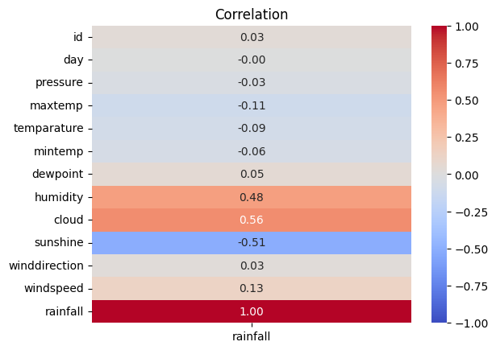

📝 Penjelasan :
   1. **cloud (0.56)** : Memiliki korelasi positif tertinggi dengan rainfall. Artinya, berdasarkan data ini, semakin tinggi nilai cloud, cenderung diikuti oleh meningkatnya rainfall (berlaku sebaliknya).
   2. **sunshine (-0.51)** : Memiliki korelasi negatif paling kuat dengan rainfall. Semakin tinggi nilai sunshine, data ini menunjukkan kecenderungan rainfall menurun.
   3. **humidity (0.25)** : **humidity** merupakan fitur ke 3 yg mempunyai **korelasi spearman** terbesar dgn fitur target (**rainfall**) <br>
   4. Fitur-fitur lainnya seperti <strong>windspeed, winddirection, dewpoint, mintemp, maxtemp, pressure, day </strong> memiliki korelasi yang tidak terlalu besar dengan fitur target (<strong>rainfall</strong>). Kita dapat mempertimbangkan untuk menghapusnya atau memeriksa fitur kepentingan untuk memilih hanya fitur-fitur yang paling penting</span><br>

----------------------------------------------------------------------------------------------------

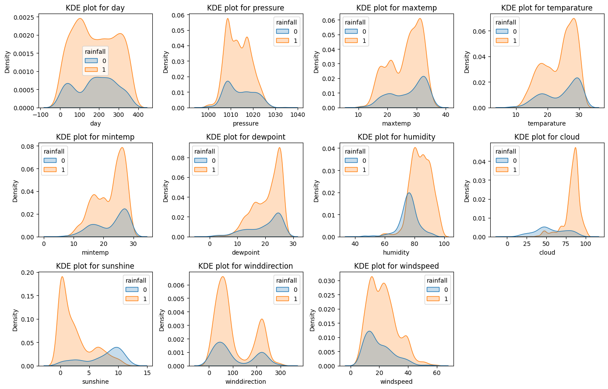

menampilkan kde plot untuk membandingkan distribusi probabilitas antara prediksi hujan dan tidak hujan. *sebenarnya visualisasi kde-plot ini sama dgn visualisasi bar chart dari distribusi rainfall tadi, namun kde-plot ini lebih mudah untuk dibaca*. <br>
      
### 🔗 Feature Importance with Tree-Based Model 🌳

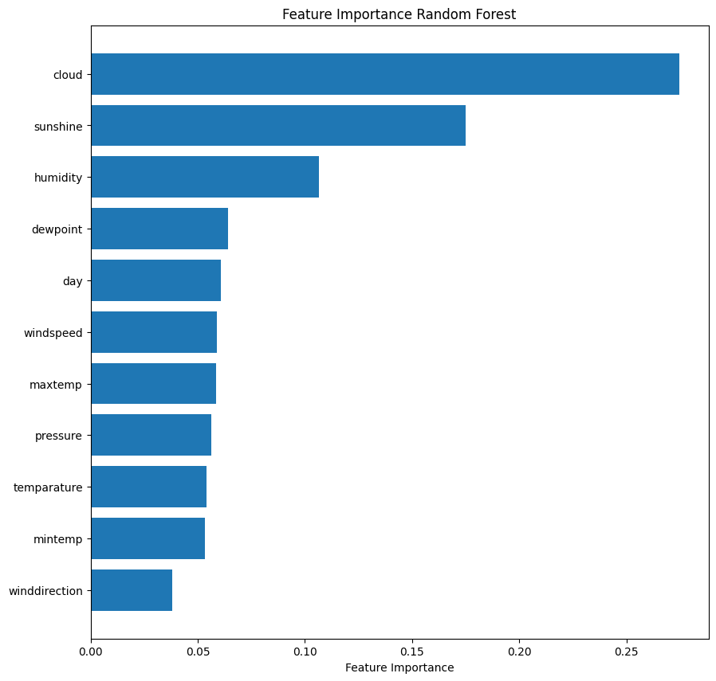

ini adalah bar chart untuk menampilkan fitur paling penting menggunakan Tree-Based Model Random Forest. 5 fitur terpenting nya adalah **cloud, sunshine, humidity, dewpoint, day**.
*Tujuannya untuk menganalisis base fitur paling penting yg berpengaruh untuk memprediksi klasifikasi dan melakukan feature engineering berdasarkan fitur2 yg paling relevan*

### 🚨 Check for Outliers 🔎
<br>

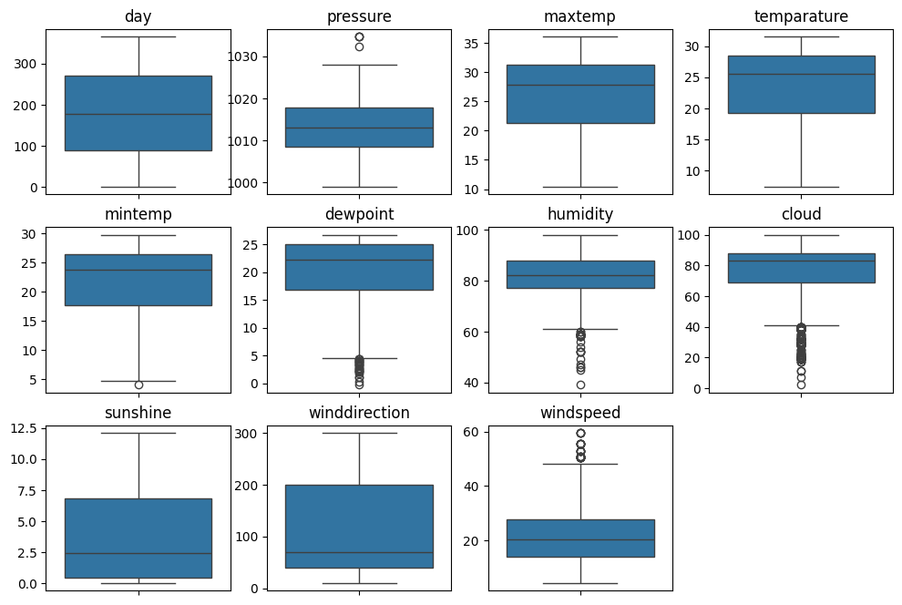

dari box-plot tsb, terdapat beberapa outlier:
   1. **pressure** : terdapat hanya ada 2 sedikit outlier. outlier seperti ini bisa kita abaikan atau bisa digunakan winsorization untuk membatasi nilai ke dalam threshold tertentu.
   2. **mintemp** : fitur ini hanya terdapat 1 outlier. kita bisa mengabaikan outlier ini.
   3. **dewpoint, humidity, cloud, windspeed** : fitur ini terdapat cukup banyak outlier. kita bisa mempertimbangkannya untuk menggunakan teknik *Capping* atau *Winsorization*. kalau misalkan outlier tidak perlu penting, bisa kita hapus outliernya (tidak disarankan untuk ini karena akan menghilangkan informasi penting dari data). kita bisa juga mempertahankan outlier ini , tapi harus menggunakan **Robust Scaling** untuk feature scaling nya , agar model lebih tahan / robust terhadap outlier.

## Data Preparation
Pada bagian ini Anda menerapkan dan menyebutkan teknik data preparation yang dilakukan. Teknik yang digunakan pada notebook dan laporan harus berurutan.
Teknik-teknik yg digunakan dalam Data Preparation antara lain :
1. Menangani Nilai yg hilang 🧹
2. Feature-Engineering : Membuat Fitur Baru 🛠️
3. Menangani Outlier 🚨
4. Split Dataset ✂️
5. Feature Scaling 📏
6. Menangani Imbalance Dataset : OVERSAMPLING ⚖️

---------------------------------------------------------------------------------------------------------------------------------------

### Menangani Nilai yg hilang 🧹
Dalam menangani nilai hilang untuk fitur *winddirection* , saya mengganti nya dengan nilai median.
```python
# HANDLING MISSING VALUES

# REPLACE NULL VALUES WITH MEDIAN
test_data['winddirection'] = test_data['winddirection'].fillna(value= test_data['winddirection'].median())  

test_data['winddirection'].isna().sum()
```
Alasannya karena jumlah nilai yg hilangnya cuman 1 , jadi tetap mempertahankan distribusi data.
### Feature-Engineering : Membuat Fitur Baru 🛠️
Dalam Feature Engineering, Saya membuat 10 Fitur Baru untuk menangkap pola tersembunyi dalam data. Fitur baru itu antara lain :
1. **temp_range** : untuk mengetahui rentang suhu pd hari itu berapa. Rentang yang besar mungkin mengindikasikan cuaca cerah (tekanan tinggi), sedangkan rentang kecil bisa menandakan langit berawan atau hujan.
```python
combined_data['temp_range'] = combined_data['maxtemp'] - combined_data['mintemp']
```
2. **temp_dew_spread** : Selisih antara suhu aktual (temperature) dan titik embun (dewpoint) mencerminkan kelembapan relatif udara.
```python
combined_data['temp_dew_spread'] = combined_data['temparature'] - combined_data['dewpoint']
```
3. **heat_index** : untuk menggabungkan suhu, titik embun, dan kelembapan untuk mengukur suhu yang "dirasakan". Nilai tinggi menunjukkan kondisi lembap dan panas.
```python
combined_data['heat_index'] = 0.5 * (combined_data['temparature'] + combined_data['dewpoint']) + 0.1 * combined_data['humidity'] - 10
```
4. **wind_east** dan **wind_north** : memahami pola angin .**wind_east** angin bertiup dari timur ke barat, **wind_north** angin bertiup dari utara ke selatan
```python
combined_data['wind_east'] = combined_data['windspeed'] * np.cos(combined_data['winddirection'])
combined_data['wind_north']= combined_data['windspeed'] * np.sin(combined_data['winddirection'])
```
5. **humidity_cloud** : memahami dan menangkap interaksi antara **humidity** (kelembapan) dgn **cloud** (persentase awan).
```python
combined_data['humidity_cloud'] = combined_data['humidity'] * combined_data['cloud']
```
6. **sunshine_cloud_ratio** : mengukur seberapa banyak sinar matahari yang tertutup awan.
```python
combined_data['sunshine_cloud_ratio'] = combined_data['sunshine'] / (combined_data['cloud'] + 1e-5)
```
7. **moisture_index** : kombinasi antara **dewpoint** (titik embun) dgn **humidity** (kelembapan) yg mencerminkan kandungan uap air di udara.
```python
combined_data['moisture_index'] = combined_data['dewpoint'] * combined_data['humidity']
```
8. **wind_chill** : menggambarkan suhu yang dirasakan akibat kombinasi suhu dan angin.
```python
combined_data['wind_chill'] = 13.12 + 0.6215 * combined_data['temparature'] - 11.37 * (combined_data['windspeed']**0.16) + 0.3965 * combined_data['temparature'] * (combined_data['windspeed']**0.16)
``` 
9. **high_rain_risk** : mengenali pola cuaca ekstrem jika **humidity > 80** dan **cloud > 80** (binary label)
```python
def set_high_rain(row):
   if row['humidity'] > 80 and row['cloud'] > 80:
      return 1
   else:
      return 0

combined_data['high_rain_risk'] = combined_data.apply(set_high_rain, axis=1)
```

### Menangani Outlier 🚨

untuk menangani outlier ini , saya menggunakan Teknik Winsorization untuk membatasi sebuah nilai yg melewati threshold. <br>

*Winsorization adalah teknik yang digunakan untuk menangani outlier dgn cara membatasi nilai-nilai ekstrem tersebut pada ambang batas tertentu, sehingga nilai-nilai tersebut tidak lagi menjadi terlalu ekstrem. singkatnya nilai yg melebihi threshold akan diubah ke dalam batas threshold tsb.*

```python
new_train_data['sunshine_cloud_ratio'] = winsorize(a = new_train_data['sunshine_cloud_ratio'], limits=[0, 0.01])
new_test_data['sunshine_cloud_ratio'] = winsorize(a = new_test_data['sunshine_cloud_ratio'], limits=[0, 0.01])
```
disini saya melakukan *Winsorization* dari train and test data untuk kolom **sunshine_cloud_ratio**. saya menetapkan threshold = 0.01 (99% persentil) . artinya nilai titik data yg melebih 99% persentil akan dibatasi ke nilai threshold tsb.


### Split Dataset ✂️
```python
x_train, x_val, y_train, y_val = train_test_split(x,y, test_size=0.20, random_state= 2025, shuffle=True)
```
Membagi data menjadi Train and Validation Data dgn proporsi 80/20. train data digunakan untuk melatih data, sedangkan validation data digunakan untuk mengevaluasi hasil model. 


### Feature Scaling 📏
```python
cols_to_robust = ['pressure', 'dewpoint', 'humidity', 'cloud', 'windspeed', 'temp_range', 'temp_dew_spread', 'humidity_cloud', 'sunshine_cloud_ratio', 'moisture_index']
cols_to_zscore = ['day','maxtemp','temparature','mintemp','sunshine','winddirection', 'heat_index', 'wind_east', 'wind_north', 'wind_chill']

# DEFINE NORMALIZATION TECHNIQUE
robust = RobustScaler()
zscore = StandardScaler()

# FIT AND TRANSFORM TRAIN DATA
x_train[cols_to_robust] = robust.fit_transform(x_train[cols_to_robust])
x_train[cols_to_zscore] = zscore.fit_transform(x_train[cols_to_zscore])

# TRANSFORM VALIDATION DATA
x_val[cols_to_robust] = robust.transform(x_val[cols_to_robust])
x_val[cols_to_zscore] = zscore.transform(x_val[cols_to_zscore])

# TRANSFORM TEST DATA
#new_test_data = copy.deepcopy(test_data)
new_test_data[cols_to_robust] = robust.transform(new_test_data[cols_to_robust])
new_test_data[cols_to_zscore] = zscore.transform(new_test_data[cols_to_zscore])
```
melakukan feature scaling dgn menggunakan 2 Teknik Normalisasi data. yaitu **Teknik Robust Scaling** , dan **Z-Score Normalization**.
**Robust Scaling** digunakan ketika data mempunyai outlier yg signifikan dan distribusi data skewed. dan **Z-Score Normalization** digunakan ketika data mendekati distribusi normal.

### Menangani Imbalance Dataset : OVERSAMPLING ⚖️
```python
# SVM SMOTE
svm_smote = SVMSMOTE(sampling_strategy=0.45, random_state= seed_value, m_neighbors = 3, k_neighbors=4)
x_resampled, y_resampled = svm_smote.fit_resample(x_train, y_train)
```
untuk menangani imbalance data, saya menggunakan teknik SVM SMOTE untuk membuat sintetis dataset. <br>
**SVM SMOTE** yaitu Teknik Oversampling yg menggabungkan algoritma **SVM** dan **SMOTE** untuk membuat *synthetic data* (data baru). **SVM SMOTE** membuat *Synthetic Data* di daerah yg dekat dgn garis _Hyperplane_ .  <br> <br>

inilah perbandingannya : 

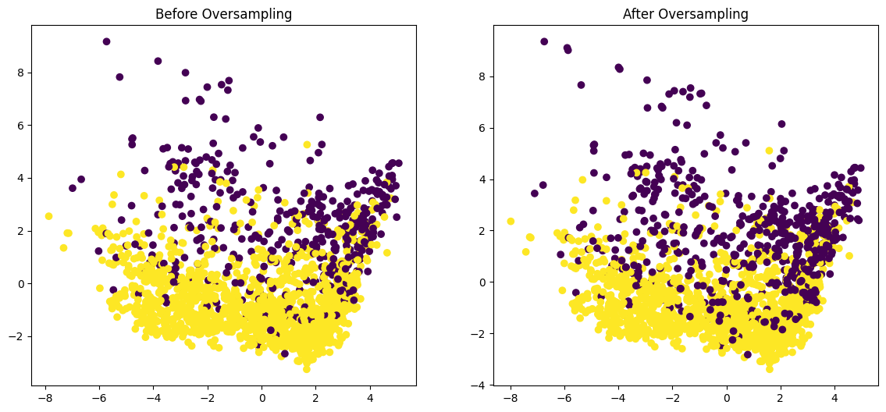


## Modeling
dalam melakukan tahap Modelling , saya akan mencoba 2 teknik yg berbeda. pertama yaitu menggunakan model Machine Learning, dan yg kedua menggunakan model Deep Learning. <br> <br>
untuk model Machine Learning, saya akan menggunakan Teknik Ensemble dan Boosting yg dikombinasikan dgn **Optuna** untuk menghasilkan model dgn *Hyperparameter Terbaik*. Tujuan saya dalam menggunakan teknik ini adalah agar model dapat mempelajari Pola Non-Linear dan dapat menangani Data yang Tidak Seimbang. <br><br>
```python
Model Boosting bekerja dengan menggabungkan beberapa model yang lebih lemah (weak learner) menjadi satu model yang lebih kuat
dan berfokus pada perbaikan kesalahan yang dibuat oleh model sebelumnya pada iterasi sebelumnya, sehingga model akhir memiliki
kemampuan prediksi yang lebih akurat dan kuat untuk data yang kompleks atau tidak seimbang. 
```
Teknik Boosting yang saya gunakan, yaitu:
<ol>
   <li><strong>Gradient Boosting Machine</strong></li>
   <li><strong>Light Gradient Boosting Machine</strong></li>
   <li><strong>Adaptive Boosting</strong></li>
   <li><strong>Xtreme Gradient Boosting Machine</strong></li>
   <li><strong>Category Boosting</strong></li>
</ol>
<br>
Kemudian setelah saya membuat semua jenis model *Boosting*, saya akan menggabungkan / menyatukan semua model tersebut menggunakan <strong>Stacking Model </strong>.<br> <br> 
<strong>Tujuannya adalah menggabungkan semuanya dan untuk menciptakan model yang lebih kuat dan canggih serta mengatasi kelemahan setiap model yang ada.</strong>
<br> 

-------------------------------------------------------------------------------------------------------------------------

lalu untuk teknik kedua yg saya gunakan yaitu teknik **Deep Learning**. Saya menggunakan **FeedForward Neural Network** untuk membangun sebuah model deep learning, lalu menggunakan **Keras-Tuner** mendapatkan hyperparameters terbaiknya. <br> <br>


### A. Machine Learning Model

### 1. **Gradient Boosting Machine**
```python
Gradient Boosting Machine (GBM) adalah metode ensemble learning yang digunakan untuk membangun model prediksi yang kuat
dengan menggabungkan beberapa model yang lebih sederhana, biasanya decision trees, secara berurutan. Tujuan utamanya
adalah untuk mengurangi kesalahan (error) dengan cara memperbaiki kesalahan dari model-model sebelumnya.
```
Secara teknis, gradient boosting adalah proses iteratif yang menggunakan gradient descent untuk mengoptimalkan fungsi loss. <br>
dalam pembangunan GBM model , saya menggunakan **Optuna** untuk mencari hyperparameter terbaik. <br>
hyperparameter yg saya gunakan untuk melatih **Gradient Boosting Machine** ialah :
1. **`n_estimators`** :  jumlah iterasi atau jumlah pohon keputusan yang akan dibangun dalam proses boosting.
2. **`learning_rate`** : mengontrol seberapa cepat model belajar untuk setiap estimator baru terhadap prediksi akhir
3. **`max_depth`** : Pmenentukan kedalaman maksimum setiap pohon keputusan dalam model boosting. Semakin dalam pohon, semakin kompleks modelnya, dan bisa meningkatkan risiko overfitting. membuat pohon yg dangkal pun bisa rentan terhadap underfitting
4. **`min_samples_split`** : menentukan jumlah minimum sampel yg diperlukan untuk membagi sebuah node dalam pohon keputusan. Jika jumlah sampel di node lebih sedikit dari nilai ini, maka node tersebut tidak akan dibagi lebih lanjut. Nilai yg lebih tinggi membantu mengurangi kompleksitas pohon dan mengurangi overfitting.
5. **`max_features`** : Ini mengontrol jumlah fitur yang dipertimbangkan untuk setiap split dalam Decision Tree
6. **`random_state`** : Seed acak untuk ke-konsistensian data

kemudian saya menjalankan optuna selama 20 trials (percobaan) untuk mencari best hyperparameternya 
```python
# BUILD OPTUNA 
study = optuna.create_study(direction='maximize')

# START TO FIND BEST HYPERPARAMETERS
study.optimize(func= gbr_objective, n_trials=20)
```
```python
# FUNCTION TO TRAIN AND FIND BEST HYPERPARAMETERS WITH OPTUNA
def gbr_objective(trial):

    # SET HYPERPARAMETER VALUE RANGE
    n_estimators     = trial.suggest_int('n_estimators', 50,2000)
    learning_rate    = trial.suggest_uniform('learning_rate', 0.001, 1)
    max_depth        = trial.suggest_int('max_depth', 2, 16)
    min_sample_split = trial.suggest_int('min_samples_split', 2, 25)
    max_features     = trial.suggest_int('max_features', 5, 60)
    
    # DECLARATE THE MODEL AND ITS HYPERPARAMETERS
    gbr = GradientBoostingClassifier(
        n_estimators      = n_estimators,
        learning_rate     = learning_rate,
        max_depth         = max_depth,
        min_samples_split = min_sample_split,
        max_features      = max_features,
        random_state      = seed_value
        )
       
    # CREATE SCORE EVALUATION (CV)
    score = cross_val_score(estimator= gbr, X= x_resampled, y= y_resampled, scoring='roc_auc')

    return score.mean()
```
setelah didapatkan best hyperparametersnya , saya melatih GBM menggunakan best hyperparameters tsb.
```python
gbr_best_params = {'n_estimators': 1588, 'learning_rate': 0.1867130929904072, 'max_depth': 16, 'min_samples_split': 11, 'max_features': 15}

gbm = GradientBoostingClassifier(random_state= seed_value, **gbr_best_params)
gbm.fit(x_resampled,y_resampled)
```
dimana **`gbr_best_params`** merupakan best hyperparameters yg telah didapatkannya.

- **Kelebihan :**
  1. GBM bisa menghasilkan hasil akurasi yg tinggi dan memuaskan
  2. GBM dapat menangani hubungan non-linear antar fitur tanpa membutuhkan transformasi data khusus (misalnya, normalisasi atau standardisasi).
  3. GBM dapat menangani data numerik maupun kategorikal. Meskipun fitur kategorikal sering kali membutuhkan pra-pemrosesan,
- **Kelemahan :**
  1. Waktu pelatihan yg sangat lama, apalagi jika dataset sangat besar.
  2. Rentan terhadap Overfitting jika terlalu banyak Decision Tree
  3. Jika dataset mengandung banyak noise, GBM dapat lebih rentan untuk "menghafal" noise tersebut, yang menyebabkan model menjadi tidak generalizable dan performanya menurun pada data yang belum pernah dilihat sebelumnya.

--------------------------------------------------------------------------
### 2. **Light Gradient Boosting Machine (LGBM)**
```python
Light Gradient Boosting Machine (LightGBM) merupakan varians dari GBM yg dikembangkan oleh Microsoft yg dirancang
untuk menangani dataset yang besar dengan efisien dan lebih cepat dibanding model Gradient Boosting Machine.
```
- **Cara kerja** :
  berbeda dgn GBM yg menggunakan pendekatan **level-wise**, LGBM menggunakan pendekatan **leaf-wise**,  yang berarti pohon dibangun dengan memilih cabang yang dapat mengurangi kesalahan (residual) paling banyak terlebih dahulu. Pendekatan ini memungkinkan LightGBM menghasilkan model yang lebih akurat, tetapi juga bisa lebih rentan terhadap overfitting jika tidak diatur dengan baik. <br>

hyperparameter yg digunakan dalam melatih dan mencari best hyperparameters nya :
1. **`boosting_type`** : menentukan jenis boosting yang digunakan oleh model
2. **`num_leaves`** : Menentukan jumlah maksimum daun (leaf) pada pohon keputusan. Ini adalah salah satu parameter penting yang mengatur kompleksitas model. Semakin banyak daun, semakin kompleks modelnya, dan bisa meningkatkan risiko overfitting.
3. **`max_depth`** : Menentukan kedalaman maksimum setiap pohon keputusan. Ini mengontrol ukuran pohon dan membantu menghindari overfitting dengan membatasi kedalaman pohon. Jika nilainya -1, kedalaman tidak dibatasi, dan pohon dapat tumbuh hingga batasan lainnya seperti num_leaves.
4. **`learning_rate`** : Ini adalah parameter yang mengontrol seberapa besar kontribusi setiap pohon keputusan terhadap prediksi akhir.
5. **`n_estimators`** : banyak nya decision tree yg akan di bangun.
6. **`min_child_weight`** : Parameter ini menentukan jumlah minimum dari total bobot data yang diperlukan dalam sebuah daun untuk membagi lebih lanjut. Ini membantu mencegah overfitting dengan memastikan bahwa setiap daun memiliki cukup data untuk membuat pembagian yang bermakna.
7. **`min_child_samples`** : Menentukan jumlah sampel minimum yang diperlukan untuk membagi sebuah node. Jika sebuah node memiliki lebih sedikit sampel daripada nilai ini, maka node tersebut tidak akan dibagi lagi. Ini juga berfungsi untuk mencegah overfitting dengan mengontrol kedalaman dan kompleksitas pohon.
8. **`subsample`** : Menentukan proporsi data yang akan dipilih secara acak untuk setiap iterasi (pohon keputusan). Jika nilai ini kurang dari 1, maka hanya sebagian data yang akan digunakan untuk melatih setiap pohon.
9. **`reg_alpha`** : parameter untuk regularisasi L1 (Lasso) untuk mencegah overfitting.
10. **`reg_lambda`** : Ini adalah parameter untuk regularisasi L2 (Ridge) untuk mengurangi overfitting dan menangani multikolinearitas fitur.

kemudian saya menjalankan optuna selama 20 trials (percobaan) untuk mencari best hyperparameternya.
```python
    num_leaves        = trial.suggest_int('num_leaves',20,100)
    max_depth         = trial.suggest_int('max_depth', 2, 15)
    learning_rate     = trial.suggest_float('learning_rate', 0.001, 0.8)
    n_estimators      = trial.suggest_int('n_estimators', 100, 2000)
    min_child_weight  = trial.suggest_int('min_child_weight', 0.5, 5)
    min_child_samples = trial.suggest_int('min_child_samples', 7, 20)
    subsample         = trial.suggest_uniform('subsample', 0.4, 1)
    reg_alpha         = trial.suggest_float('reg_alpha', 0.02, 15)
    reg_lambda        = trial.suggest_float('reg_lambda', 0.02, 15)
```
setelah didapatkan best hyperparametersnya , saya melatih LGBM menggunakan best hyperparameters tsb.
```python
lgbm_best_params = {'num_leaves': 20, 
                    'max_depth': 11, 
                    'learning_rate': 0.5416470737551435, 
                    'n_estimators': 822, 
                    'min_child_weight': 0, 
                    'min_child_samples': 16, 
                    'subsample': 0.9819909834877366, 
                    'reg_alpha': 0.18493572725631813, 
                    'reg_lambda': 11.022396550855765}

lgbm = lightgbm.LGBMClassifier(random_state= seed_value, **lgbm_best_params)
lgbm.fit(x_resampled, y_resampled)
```

- **Kelebihan :**
  1. LGBM lebih cepat dibanding Gradient Boosting Machine. bahkan bisa lebih cepat dibanding Model Ensemble lainnya
  2. LGBM menggunakan lebih sedikit memori karena teknik pembagian histogram
  3. LGBM dapat menangani fitur kategorikal secara langsung tanpa perlu melakukan encoding manual (seperti one-hot encoding atau label encoding).
- **Kelemahan :**
  1. Rentan terhadap Overfitting jika terdapat banyak Noise
  2. sangat sensitif terhadap pemilihan parameters. jadi sebisa mungkin gunakan Cross-Validation untuk pemilihan Best Parameters
 
--------------------------------------------------------------------------------

### 3. **Adaptive Boosting (AdaBoost)**
```python
AdaBoost adalah salah satu teknik boosting yg menggabungkan beberapa model decision tree yg lemah (weak learner)
menjadi satu model yg lebih kuat.
```
hyperparameter yg saya gunakan untuk melatih **Adaptive Boosting** ialah :
1. **`base_estimator`** : Ini adalah model dasar (atau estimator) yang digunakan oleh AdaBoost untuk membangun ensemble. Secara default, estimator dasar adalah Decision Tree
2. **`n_estimators`** : Ini menentukan jumlah estimator atau iterasi yang akan digunakan dalam proses boosting. Setiap estimator bertugas memperbaiki kesalahan yang dilakukan oleh model sebelumnya dengan memberikan bobot lebih pada contoh data yang salah diprediksi. Semakin banyak estimators, semakin kompleks modelnya, tetapi juga dapat meningkatkan risiko overfitting jika jumlahnya terlalu tinggi.
3. **`learning_rate`** : Learning rate mengontrol seberapa besar kontribusi setiap estimator baru terhadap model akhir.

kemudian saya menjalankan optuna selama 20 trials (percobaan) untuk mencari best hyperparameternya.
```python
n_estimators = trial.suggest_int('n_estimators', 50, 1000)
    learning_rate = trial.suggest_float('learning_rate', 0.01, 1.0)
    base_estimator_max_depth = trial.suggest_int('base_estimator_max_depth', 3, 15)

    # SET DECISION TREE AS BASE ESTIMATOR
    base_estimator = DecisionTreeClassifier(max_depth=base_estimator_max_depth)

    # DECLARATE ADABOOST MODEL
    adaboost = AdaBoostClassifier(base_estimator=base_estimator,
                                 n_estimators=n_estimators,
                                 learning_rate=learning_rate)
```
pada kode tsb, saya menggunakan **Decision Tree** sebagai base estimator nya. kamu bisa mengganti base estimator menjadi model lain seperti **Logistic Regression, Support Vector Machine (SVM), Naive Bayes**, atau yg lainnya. <br> <br>

setelah didapatkan best hyperparametersnya , saya melatih **AdaBoost** menggunakan best hyperparameters tsb.
```python
adaboost_best_params = {'n_estimators': 631, 'learning_rate': 0.9873704642286297, 'base_estimator_max_depth': 12}

base_estimator = DecisionTreeClassifier(max_depth=adaboost_best_params['base_estimator_max_depth'])

adaboost = AdaBoostClassifier(
    base_estimator=base_estimator,
    n_estimators=adaboost_best_params['n_estimators'],
    learning_rate=adaboost_best_params['learning_rate'],
    random_state=seed_value
)
```

- **Kelebihan :**
  1. Adaboost bisa menggabungkan model selain Decision Tree (Seperti Logistic Regression, SVM, dll) yg bisa menghasilkan prediksi yg lebih akurat.
  2. Pada dataset yang tidak terlalu besar, AdaBoost dapat memberikan kinerja yang sangat baik, terutama pada dataset yang memiliki banyak noise atau outlier.
  3. Adaboost lebih mudah diimplementasikan dan tidak terlalu banyak parameter
 
- **Kelemahan :**
  1. Jika dataset sangat besar, AdaBoost bisa membutuhkan waktu yang cukup lama untuk melatih model karena ia melakukan banyak iterasi dan mengharuskan pelatihan model pada beberapa subset data dengan bobot yang berubah setiap kali.
  2. Adaboost kurang efektif jika menangani multikelas
  

-------------------------------------------------------------------------------------------

### 4. **Extreme Gradient Boosting Machine (XGBOOST)**
```python
XGBoost merupakan salah satu teknik ensemble yg digunakan dalam membuat model machine learning.
Setiap pohon keputusan yang dibangunfokus pada mengurangi kesalahan yang belum terprediksi
oleh pohon sebelumnya, menggunakan optimasi gradient descent. XGBoost meningkatkan efisiensi dengan regularisasi
untuk mencegah overfitting, parallelization untuk mempercepat proses pelatihan,serta menggunakan
second-order approximation (turunan kedua) untuk optimasiyang lebih cepat dan akurat.
Selain itu, XGBoost juga menangani data hilang secara otomatis
```
<br>
hyperparameter yg saya gunakan untuk melatih **XGBoost** ialah :

1. **`n_estimators`** : jumlah model Decision tree yg akan dibangun.
2. **`learning_rate`** : seberapa besar kontribusi setiap pohon keputusan yang baru ke dalam prediksi akhir.
3. **`max_depth`** : Kedalaman maksimum untuk setiap Decision Tree
4. **`min_child_weight`** : Menentukan bobot minimum total sampel dalam satu anak cabang pohon keputusan.
5. **`subsample`** : Menentukan proporsi sampel yang digunakan untuk membangun setiap pohon.
6. **`gamma`** : Menentukan regularisasi tambahan yang diterapkan pada pembelahan pohon.
7. **`reg_alpha`** : Menentukan regularisasi L1 (Lasso) untuk mengurangi overfitting dan menghapus fitur yg tidak relevan.
8. **`reg_lambda`** : menentukan regularisasi L2 (Ridge) untuk mengurangi overfitting dan Mencegah Multikolinearitas
9. **`Random_state`** : Seed Acak

sebelum melatih XGBoost, saya terlebih dahulu menemukan best hyperparameters menggunakan Optuna. saya melakukan Cross Validation menggunakan Optuna sebanyak 20 Trials (Percobaan). <br>

setelah didapatkan best hyperparametersnya , saya melatih **XGBoost** menggunakan best hyperparameters tsb.
```python
xgb_best_params = {'n_estimators': 751, 'learning_rate': 0.2370081389976112, 'max_depth': 7, 'min_child_weight': 9.895958505716344, 'subsample': 0.6370760160975184, 'gamma': 0.11998250705831778, 
'reg_alpha': 6.265433235121968, 'reg_lambda': 4.36382054864632}

xgboost = xgb.XGBClassifier(random_state= seed_value, **xgb_best_params)
xgboost.fit(x_resampled, y_resampled)
```

- **Kelebihan :**
  1. cepat dan lebih efisien dalam pelatihannya
  2. Hasil Evaluasi nya memuaskan
- **Kekurangan :**
  1. Penggunaan Memori sangat tinggi , bahkan jika model nya kompleks dan data nya terlalu besar
  
---------------------------------------------------------------------------------------------

### 5. Categorical Boosting (CatBoost)
```python
Categorical Boosting A.K.A CatBoost adalah algoritma Ensemble yg dikembangkan oleh Yandex (Perusahaan Russia).
Singkatnya, CatBoost adalah implementasi dari Gradient Boosting yang mengoptimalkan model dengan menggunakan prinsip
gradient descent untuk meminimalkan fungsi kerugian (loss function).
```

- **Cara Kerja** : CatBoost bekerja dengan menggunakan prinsip gradient boosting, di mana model dibangun secara iteratif dengan menambahkan pohon keputusan baru untuk mengurangi kesalahan dari pohon sebelumnya. CatBoost secara khusus mengatasi data kategorikal dengan cara target encoding yg efisien, sehingga tidak memerlukan pra-pemrosesan seperti One-Hot Encoding atau Label Encoding. Selain itu, CatBoost menggunakan teknik **ordered boosting** yg menghindari overfitting dengan permutasi acak dalam pembagian data, serta penerapan regularisasi untuk meningkatkan generalisasi model. Algoritma ini dirancang untuk mengelola dataset besar dengan cepat dan efisien, serta secara otomatis menangani nilai yang hilang tanpa memerlukan banyak pengaturan atau intervensi dari pengguna.

hyperparameter yg digunakan untuk melatih **CatBoost** ialah :

1. **`iterations`** : jumlah total iterasi atau pohon keputusan (trees) yang akan dibangun selama proses pelatihan.
2. **`learning_rate`** : mengontrol seberapa besar model belajar untuk setiap Decision Tree yg dibangun
3. **`depth`** : Kedalaman maksimum dari Decision Tree
4. **`l2_leaf_reg`** : parameter regularisasi yang mengontrol penalti pada bobot pohon keputusan untuk mencegah overfitting
5. **`subsample`** : proporsi sampel data yang digunakan untuk membangun setiap pohon keputusan. nama lainnya disebut subsampling
6. **`colsample_bylevel`** : Menentukan proporsi fitur yang dipilih secara acak pada setiap level pohon.
7. **`min_data_in_leaf`** : jumlah minimum data yang diperlukan dalam sebuah leaf pohon keputusan.
8. **`max_bin`** : jumlah maksimum bin yang digunakan untuk memproses fitur kontinu. Fitur kontinu akan dibagi menjadi beberapa bin untuk mempercepat pembelajaran.

sebelum melatih CatBoost, saya terlebih dahulu menemukan best hyperparameters menggunakan Optuna. saya melakukan Cross Validation menggunakan Optuna sebanyak 20 Trials (Percobaan). <br>
setelah didapatkan best hyperparametersnya , saya melatih **CatBoost** menggunakan best hyperparameters tsb.
```python
# FIT AND TRAIN CATBOOST MODEL

catboost_best_params = {'iterations': 445, 'learning_rate': 0.031759978116715874, 'depth': 10, 'l2_leaf_reg': 0.13465148784245187, 'subsample': 0.6277247041610173, 
'colsample_bylevel': 0.712156508332904, 'min_data_in_leaf': 67, 'max_bin': 111}

cat = catboost.CatBoostClassifier(random_state= seed_value, devices=0,**catboost_best_params)
cat.fit(x_resampled, y_resampled)
```

- **Kelebihan :**
  1. Bisa menangani data kategorical langsung tanpa harus diubah ke dalam ordinal encoding/one-hot encoding. catboost secara otomatis menangani data kategorical menggunakan *Target Encoding*.
  2. CatBoost menggunakan teknik **Ordered Boosting** yg bisa mengurangi overfitting, bahkan ketika distribusi data tidak seimbang dan banyak outlier
  3. CatBoost bisa digunakan untuk Klasifikasi, Regresi, dan Ranking.
- **Kelemahan :**
  1. CatBoost memakan banyak memori, bahkan ketika model terlalu kompleks dan dataset nya besar.
  2. Pada beberapa kasus di mana dataset memiliki banyak fitur numerik dan sedikit fitur kategorikal, CatBoost mungkin tidak memberikan performa yang lebih baik dibandingkan dengan algoritma lain yang lebih terfokus pada fitur numerik.

-----------------------------------------------------------------------------------------------

### 6. Stacking Model (Fusion All Created Model)
setelah melatih model ensemble, selanjutnya kita akan menggabungkan semua model tersebut menjadi 1 model yg lebih kuat menggunakan Stacking Model.

- **Cara Kerja :**
  Stacking Model bekerja dgn melatih beberapa model dasar (base models) pada dataset yang sama, lalu menggunakan prediksi dari model-model tersebut sebagai input untuk melatih model (disebut sebagai meta-model).
  ```python
  model = StackingClassifier(
    estimators=[
        ('GBM', gbm),
        ('LGBM', lgbm,),           
        ('AdaBoost', adaboost),
        ('xgb', xgboost),
        ('catboost', cat)
    ],  
        final_estimator = RandomForestClassifier(),  # META-MODEL
        cv=cv_fold )

Model seperti GBM, LGBM, AdaBoost, XGBoost, CatBoost merupakan Base Model nya. sedangkan Random Forest merupakan Meta-Modelnya. <br>
Note : Meta-model bisa menggunakan jenis model yg lain, seperti Logistic Regression, Support Vector Machine (SVM), K-NN, dll.

setelah dilatih, maka bentuk pipeline nya seperti ini :

 

ok mari kita check base model yg paling berpengaruh dan penting dalam Stacking Model :
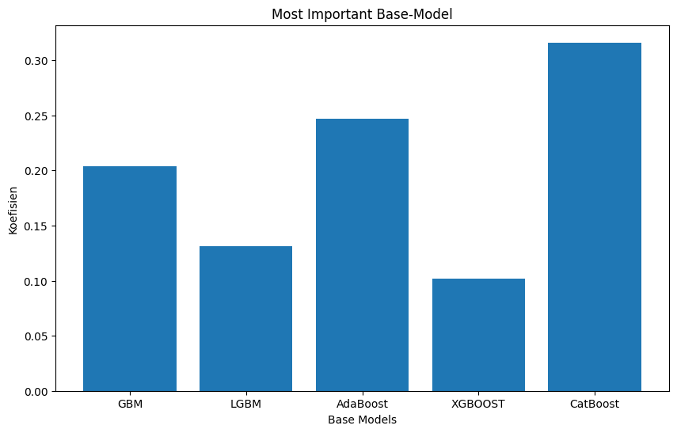

diurutan pertama ada CatBoost yg memberikan kontribusi signifikan, diikuti dgn AdaBoost, GBM, LGBM, XGBoost. <br> <br>

**ok sekarang saya akan menilai dan mengevaluasi seberapa akurat Stacking Model ini menggunakan Metric Evaluasi Roc-Auc.**  <br>


**alasan saya menggunakan ROC-AUC ialah untuk memberikan gambaran keseluruhan kinerja model, tanpa terpengaruh oleh imbalance data (ketidakseimbangan data) dan bisa memberikaan gambaran untuk performa model dari berbagai threshold**. ROC-AUC mempertimbangkan trade-off antara True Positive Rate (TPR) dan False Positive Rate (FPR) pada berbagai ambang batas, sehingga memberikan evaluasi yang lebih stabil dan reliabel dibandingkan metrik lain seperti akurasi, yang bisa menyesatkan ketika dataset tidak seimbang. <br>

- **ROC-AUC terdiri dari 2 komponen utama**

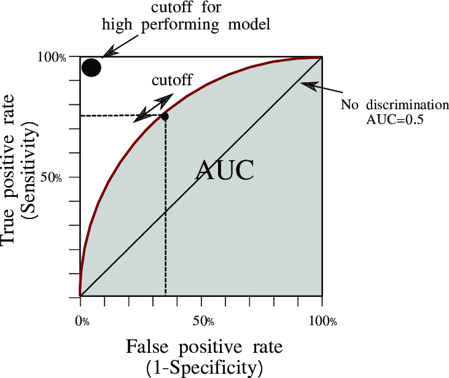

<br>

1. **ROC CURVE (Receiver Operating Characteristic Curve)**
   ROC curve adalah grafik yang menggambarkan hubungan antara **True Positive Rate (TPR)** dan **False Positive Rate (FPR)** pada berbagai threshold klasifikasi.
   - **True Positive Rate (TPR)** : dikenal sebagai recall atau sensitivitas, yaitu mengukur proporsi kasus positif yang benar-benar terdeteksi sebagai positif oleh model.
     ```python
     TPR= True Positives / ( False Negatives / True Positive )
     ```
   - **False Positive Rate (FPR)** mengukur proporsi kasus negatif yang salah diklasifikasikan sebagai positif oleh model.
     ```python
     FPR=  False Positives / (True Negatives + False Positives)
     ```
2. **AUC (Area Under the Curve)**
   AUC mengukur luas area di bawah ROC curve, yang memberi gambaran seberapa baik model dalam membedakan antara kelas positif dan negatif. AUC > 0.5 menunjukkan model yang lebih baik dari tebakan acak, dan semakin mendekati 1 semakin baik.

<br><br>
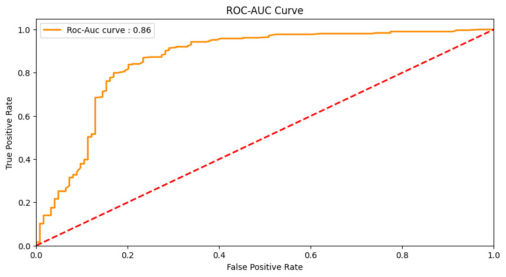

Nilai AUC sebesar 0,8 menunjukkan bahwa model memiliki kemampuan yang baik dalam membedakan kelas positif (hujan) dan negatif (tidak hujan). Nilai ini berada pada rentang sangat baik (0,8-1,0). ok sekarang mari kita tampilkan nilai distribusi probabilitas nya yg diprediksi oleh model dari data validation

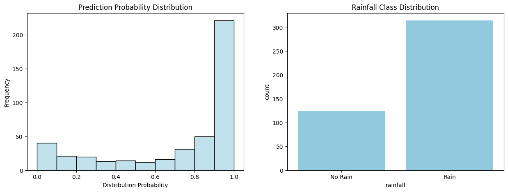

- Nilai probabilitas yang mendekati 1 berarti model sangat yakin dalam memprediksi bahwa prediksi tersebut adalah hujan.
- Nilai probabilitas yang mendekati 0 berarti model sangat yakin dalam memprediksi bahwa tidak akan turun hujan.
Nilai probabilitas yang berada di tengah-tengah antara rentang 0 - 1 (misalnya ~0,5) menunjukkan bahwa model ragu-ragu dalam memprediksi apakah akan turun hujan atau tidak. <br>
<strong>Dari histogram Di Atas, model lebih yakin dalam memprediksi data yang diyakini akan turun hujan daripada dalam memprediksi data yang diyakini tidak turun hujan.</strong>

-------------------------------------------------------------------------------------------------------------

### B. Deep Learning Model
setelah membuat Stacking Model, selanjutnya saya akan membuat Deep Learning Model menggunakan Arsitektur FeedForward Neural Network, dan hasil akhirnya akan saya bandingkan dgn model yg dibuat sebelumnya.  <br>


dalam membangun arsitektur Neural Network ini, saya menggunakan Keras-Tuner untuk membuat dan memilih nilai neuron beserta komponen nya yg terbaik secara otomatis


   
**Rubrik/Kriteria Tambahan (Opsional)**: 
- Menjelaskan kelebihan dan kekurangan dari setiap algoritma yang digunakan.
- Jika menggunakan satu algoritma pada solution statement, lakukan proses improvement terhadap model dengan hyperparameter tuning. **Jelaskan proses improvement yang dilakukan**.
- Jika menggunakan dua atau lebih algoritma pada solution statement, maka pilih model terbaik sebagai solusi. **Jelaskan mengapa memilih model tersebut sebagai model terbaik**.


## Evaluation
Pada bagian ini anda perlu menyebutkan metrik evaluasi yang digunakan. Lalu anda perlu menjelaskan hasil proyek berdasarkan metrik evaluasi yang digunakan.

Sebagai contoh, Anda memiih kasus klasifikasi dan menggunakan metrik **akurasi, precision, recall, dan F1 score**. Jelaskan mengenai beberapa hal berikut:
- Penjelasan mengenai metrik yang digunakan
- Menjelaskan hasil proyek berdasarkan metrik evaluasi

Ingatlah, metrik evaluasi yang digunakan harus sesuai dengan konteks data, problem statement, dan solusi yang diinginkan.

**Rubrik/Kriteria Tambahan (Opsional)**: 
- Menjelaskan formula metrik dan bagaimana metrik tersebut bekerja.

**---Ini adalah bagian akhir laporan---**

_Catatan:_
- _Anda dapat menambahkan gambar, kode, atau tabel ke dalam laporan jika diperlukan. Temukan caranya pada contoh dokumen markdown di situs editor [Dillinger](https://dillinger.io/), [Github Guides: Mastering markdown](https://guides.github.com/features/mastering-markdown/), atau sumber lain di internet. Semangat!_
- Jika terdapat penjelasan yang harus menyertakan code snippet, tuliskan dengan sewajarnya. Tidak perlu menuliskan keseluruhan kode project, cukup bagian yang ingin dijelaskan saja.

